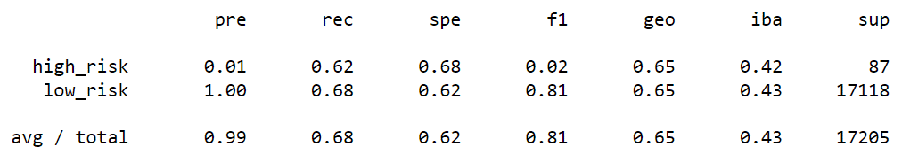
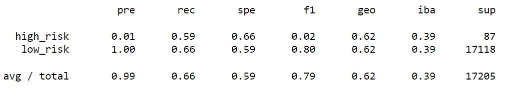
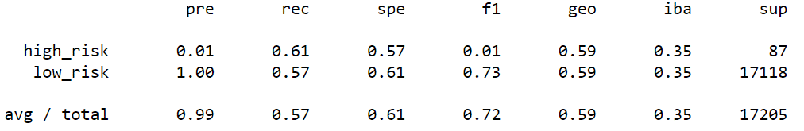
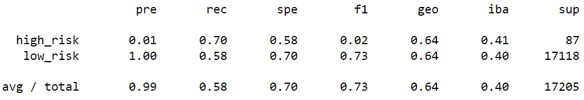
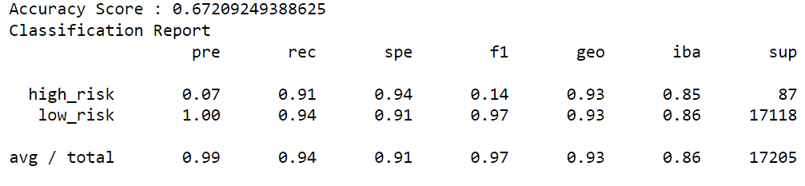
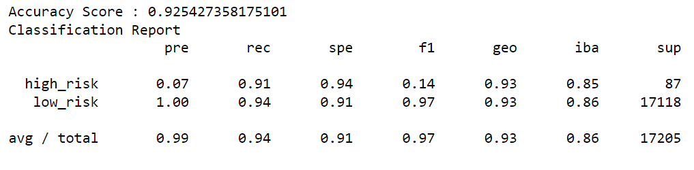

# Credit_Risk_Analysis

## Overview
The purpose of this analysis is to help predict if someone has a high or low risk status for a loan based on several factors. Using the credit card credit dataset from LendingClub, several models with unbalanced classes (good loans and risky loans) were trained and evaluated. The imbalanced-learn and scikit-learn libraries were used to build and evaluate these models using the following resampling algorithms -

- RandomOverSampler (oversample)
- SMOTE (oversample)
- ClusterCentroids (undersample)
- SMOTEENN (combinatorial)
- BalancedRandomForestClassifier (reduce bias)
- EasyEnsembleClassifier (reduce bias)

## Results
To compare the models, the balanced accuracy scores, precision, and recall scores are analyzed.

- Balanced accuracy score: How often the classifier is correct with the model.
- Precision: The measure of how reliable a positive classification is. A low precision is indicative of a large number of false positives.
- Recall score: The ability of the classifier to find all the positive samples. A low recall is indicative of a large number of false negatives.

### RandomOverSampler (oversample)
- Balanced accuracy score = 65%
- Precision = 1%
- Recall score = 62%

### SMOTE (oversample)
- Balanced accuracy score = 62%
- Precision = 1%
- Recall score = 59%

### ClusterCentroids (undersample)
- Balanced accuracy score = 59%
- Precision = 1%
- Recall score = 61%

### SMOTEENN (combinatorial)
- Balanced accuracy score = 64%
- Precision = 1%
- Recall score = 70%

### BalancedRandomForestClassifier (reduce bias)
- Balanced accuracy score = 67%
- Precision = 1%
- Recall score = 91%

### EasyEnsembleClassifier (reduce bias)
- Balanced accuracy score = 93%
- Precision = 1%
- Recall score = 91%

##Summary
Overall, each model produced weak precision, which is indicative of a large number of false positives. Looking at recall scores, both the BalancedRandomForestClassifier and EasyEnsembleClassifier models outperformed the other models, meaning they are more effective at finding the positive samples.

Out of the five models, I would recommend the EasyEnsembleClassifier, due to it having the highest balanced accuracy score and tied for the highest recall score. However, due to the extremely low precision for each model, I would advise additional models and testing to be conducted until the precision has increased. With all the current models, there will be countless low credit risk individuals marked as high credit risk and denied a line of credit.
